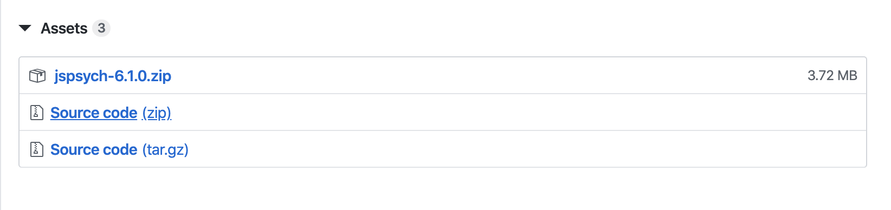

# はじめに

本記事は，「jsPsych による心理学実験作成チュートリアル」の第 1 回の記事です。今回は jsPsych をインストールし，とりあえず刺激を提示してみます。詳細は右側の見出しリストをご覧ください。

<!-- このチュートリアルシリーズの目的・概要等が気になった方はこちらの[全体のまとめ](https://qiita.com/snishym/items/8b52db0d901cf5744463)をご一読ください。 -->

# 下準備

### jsPsych のインストール

[公式のダウンロードページ](https://github.com/jspsych/jsPsych/releases)にある zip ファイルをダウンロードしてください。特別な必要のない限り，最新版で大丈夫です。少しスクロールすると下図のような表示があるはずです。



ダウンロードしたら zip ファイルを展開してください。

### 練習用のフォルダを作成

展開したフォルダ内に`practice`みたいな名前で練習用のフォルダを新規作成してください（なんでもいいです）。

### ファイルの拡張子を表示する

https://pc-karuma.net/windows-10-show-explorer-file-name-extension/
を参考にファイルの拡張子が表示されるようにしてください。リンク先のページでは拡張子についても簡単に説明があります。

### テキストエディタを用意する

実験用のスクリプトを編集するためにテキストエディタが必要です。なんでも構いません。私は普段[Visual Studio Code](https://azure.microsoft.com/ja-jp/products/visual-studio-code/)を使用しています。表示言語を日本語にしたい場合は[このページ](https://www.kkaneko.jp/tools/win/vscode.html)を参考にしてみてください。Windows 用の説明ですが，Mac でも同様の方法で日本語化できるはずです。

# とりあえず jsPsych を使ってみる

### 新規ファイルの作成

テキストエディタを開いて，新しいファイルを新規作成してください。Visual Studio Code なら（おそらく他の多くのエディタでも）`control + n`（Mac の場合は`command + n`）で新規ファイルが作成できます。

### 文字列を表示する

新しいファイルに以下のコードを入力し，ファイルを保存してください。初回はファイル名を要求されるので**後で見返したときに分かりやすい名前にしましょう**。例えば，下のコードエリアの左上に書いてあるように，`hello-world.html`と付けて，ダウンロードした jsPsych のフォルダ下に作成した`practice`フォルダの中に保存してください。ファイル名は**半角英数字にし**，**最後に.html をかならず付けてください**

そして，フォルダ内に保存された`hello-world.html`をダブルクリックで開いてください。ブラウザ（chrome や firefox など）が起動し，中央に「hello world!」と書かれたページが開くはずです。

```html:hello-world.html
<!DOCTYPE html>
<html>
<head>
  <script src="../jspsych.js"></script>
  <script src="../plugins/jspsych-html-keyboard-response.js"></script>
  <link rel="stylesheet" href="../css/jspsych.css"></link>
</head>
<body></body>
<script>

  var trial = {
    type: 'html-keyboard-response', // 試行のタイプ指定
    stimulus: 'hello world!', // 提示する刺激
  }

  jsPsych.init({
    timeline: [trial], // 提示順序の指定
  });
</script>

</html>
```

さっそくコードがたくさん書かれていて気が滅入りそうですが，ひとまず重要なのは以下の 2 点です。

1. jsPsych プラグインの読み込み（4-5 行目）
2. メインのコード（10-18 行目）

まず，プラグイン（必要な機能がまとめられたファイル）の読み込みについて，ここでは 2 つのプラグインを読み込んでいます[^1]。
1 つ目は，`jspsych.js`という jsPsych の本体です。これがすべての機能の核となっているので，どのコードでもこれを必ず最初に読み込みます。
2 つ目は，`jspsych-html-keyboard-response.js`という（主に）文字列の提示[^2]およびそれに対する反応の取得を可能にするプラグインです。

[^1]: [公式リファレンス](https://www.jspsych.org/core_library/jspsych-core/)を見ると，jsPsych の開発者らは，`jspsych.js`をライブラリと呼んでいますが，これらの用語の違いを私は理解していないので，簡単のため，どちらもプラグインと呼びます。
[^2]: 「文字列の提示」ではなく「html の要素の提示」と表現するほうが正しいです。このプラグインを使って画像を提示することも可能です。画像の提示にはそれ専用のプラグインがあるので，この`html-keyboard-response`は文字列提示用のプラグインだと考えてもらって（今のところは）大丈夫だと思います。ただ，提示する文字列の見栄えや位置を変更する際には，`stimulus:`の部分で html タグを追加したりすることになるので，このプラグインが単に文字列を扱っているのではなく，html を扱っているのだということを頭の片隅に置いておいてもらえればと思います。

次に，メインのコードを解説します。
`var trial = ...`の部分で「ある試行」を作成しています。今回はその試行に`trial`という名前をつけています。`{}`の中で試行の設定ができます。

- `type: 'html-keyboard-response'`と最初に試行のタイプを指定し，`jspsych-html-keyboard-response.js`を使った試行（つまり，文字列が刺激で，場合によっては反応を取得する試行）であることを宣言しています。
- `stimulus: 'hello world!`で，提示する文字列を指定しています。

試行を作成する際には，初めの`var`と`{}`，各行の最後にある`,`を忘れないでください。

`jsPsych.init()`で実験のフローを作成し，実行します。`timeline:`で，試行の順序を指定できます。今回は`trial`という試行を 1 度だけ実行するので，`[trial]`とします（`[]`を忘れない！）。

それぞれの行の右のほうに書いているコメントの通りです。なお，Javascript では，`//`に続けてメモを書くことができます[^3]。他の人や将来の自分のために，なるべくメモを残しておくようにしましょう。

[^3]: もう少し詳しく言うと，`//`より右側はコードとして認識・処理されません。したがって，メモを書くときだけでなく，一時的にある行のコードを実行したくない場合にも`//`は便利です。行頭に`//`をつけて行ごとコメント化し，処理を回避できます（コメントアウトと言います）。 VS Code 上では，`control + /` (Mac なら`Command + /`)で（複数行でも）コメントアウトができます。

#### キー入力を指定する

先ほどの例では，どのキーを押しても提示された`hello world`が画面から消失するようにできていました。気づいていなかった場合は試してみてください。jsPsych では，受け付けるキーを指定しない場合，すべてのキー入力を受け付けるようになっています。

受け付けるキーを指定する方法はとても簡単です。刺激作成のコードに，`choices: [何かしらのキー]`を足します。

```html:accept-some-keys.html
<!DOCTYPE html>
<html>
<head>
  <script src="../jspsych.js"></script>
  <script src="../plugins/jspsych-html-keyboard-response.js"></script>
  <link rel="stylesheet" href="../css/jspsych.css"></link>
</head>
<body></body>
<script>

  var trial = {
    type: 'html-keyboard-response',
    stimulus: 'hello world!',
    choices: ['f', 'j'], // 入力キーの指定
  }

  jsPsych.init({
    timeline: [trial],
  });
</script>

</html>
```

この例では，`'f'`と`'j'`を指定しています（このとき文字の前後にクォーテーション`'`を必ずつける）。一部のキー（e.g., 方向キー）を指定する場合は，対応するキーコードを`[]`内に入れる必要があります。例えば，右方向キーの入力を受け付けたい場合は`39`をいれます。キーコードで指定する場合はクォーテーションは付けてはいけません。ちなみに，スペースキーは`'space'`で反応するみたいです。各キーに対応するキーコードは https://www.cambiaresearch.com/articles/15/javascript-char-codes-key-codes で調べることができます。また，`[]`内にひとつでも認識されないキー（コード）が入っていると，キー入力を認識しなくなります。

その他，刺激の提示時間（`stimulus_duration`），1 試行の持続時間（`trial_duration`），反応と同時に次の試行に遷移するかどうか（`response_ends_trial`）を指定することができます（[公式リファレンス](https://www.jspsych.org/plugins/jspsych-html-keyboard-response/)）。例えば，以下のように`trial`の中身を変更すると，2000ms の試行のうち，はじめの 1000ms だけ刺激が提示されることになります。反応があっても 2000ms 経過するまで参加者は待つことになります。色々試してみてください。

```javascript
var trial = {
  type: "html-keyboard-response",
  stimulus: "hello world!",
  choices: ["f", "j"],
  stimulus_duration: 1000,
  trial_duration: 2000,
  response_ends_trial: false, // 反応取得後に次の試行に移る場合は true にする
};
```

### 画像を提示する

#### 下準備

提示するための画像を練習用のフォルダ（`practice`）に用意します。[リンク](https://www.jspsych.org/img/jspsych-logo.jpg)から画像ファイルをダウンロードして`jspsych-logo.jpg`という名前で保存してください。

#### コードを書く

新しいファイルを作成して，以下のコードを書いてください。

```html:show-image.html
<!DOCTYPE html>
<html>
<head>
  <script src="../jspsych.js"></script>
  <script src="../plugins/jspsych-image-keyboard-response.js"></script>
  <link rel="stylesheet" href="../css/jspsych.css"></link>
</head>
<body></body>
<script>

  var trial = {
    type: 'image-keyboard-response',
    stimulus: 'jspsych-logo.jpg',
  }

  jsPsych.init({
    timeline: [trial]
  });
</script>

</html>
```

ブラウザの中央に画像が表示されたはずです。

直前の`hello-world`から 3 点変更点があります。

1. 読み込むプラグインを`jspsych-image-keyboard-response.js`に変更（さっきは jspsych-**html**-keyboard-response.js）。
2. `type:`を`image-keyboard-response`に変更（さっきは **html**-keyboard-response）
3. `stimulus:`に保存したファイル名を指定

うまく画像が表示されない場合は，ファイルの名前や保存先が間違っているかもしれません。

# おわりに

以上で第 1 回は終了です。文字・画像刺激以外にも，動画や音声，リッカートスケールなども提示することができます。jsPsych 内にある examples フォルダに，サンプルのコード（それぞれ jspsych-video-keyboard-response.html, jspsych-audio-keyboard-response.html, jspsych-survey-likert.html など）をブラウザで開いて試してみたり，テキストエディタで開いてそのスクリプトを確認してみてください。

次回は，実験課題の基本である刺激の系列提示を行います。

<!-- [【第 2 回】刺激の系列提示](https://qiita.com/snishym/items/31c980f08e62190469f9) -->
